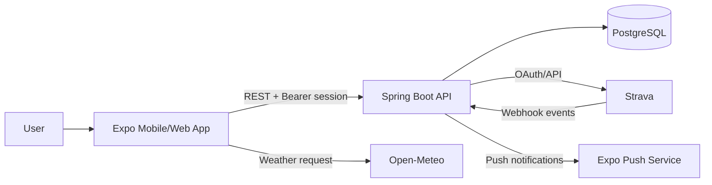
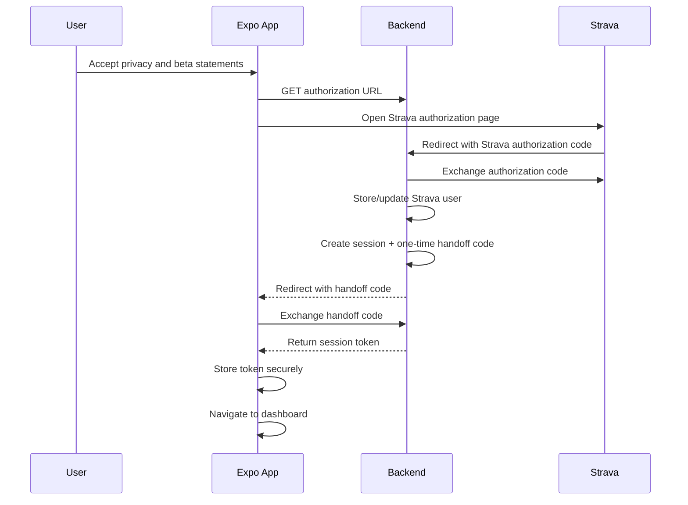

# Smart Gauge

Smart Gauge is a mobile-first endurance training and recovery application. It connects to Strava, imports recent activities, lets athletes record recovery check-ins, and presents training, pain, mood, and weather-related information.

This document explains the current architecture, application flow, security model, development setup, deployment requirements, testing strategy, and important maintenance notes.

## 1. Product Overview

Smart Gauge has four primary responsibilities:

1. Connect an athlete's Strava account.
2. Import Strava activities and keep activity data temporarily available.
3. Collect recovery check-ins associated with activities.
4. Display dashboard, history, and analysis views in the mobile application.

The application consists of:

- An Expo/React Native client in `mobile/`.
- A Spring Boot REST API in `backend/backend/`.
- PostgreSQL for persistent application data.
- Strava OAuth and activity APIs.
- Strava webhooks for activity create, update, and delete events.
- Expo Push Notifications for new-activity reminders.
- Open-Meteo for weather data used during recovery check-ins.

## 2. Repository Structure

```text
trainGuard/
├── backend/
│   └── backend/
│       ├── build.gradle
│       ├── Dockerfile
│       ├── gradlew
│       ├── gradlew.bat
│       └── src/
│           ├── main/java/com/trainguard/backend/
│           │   ├── activity/
│           │   ├── analysis/
│           │   ├── cleanup/
│           │   ├── config/
│           │   ├── dashboard/
│           │   ├── deletion/
│           │   ├── recovery/
│           │   ├── session/
│           │   ├── strava/
│           │   └── userActions/
│           ├── main/resources/application.yml
│           └── test/java/com/trainguard/backend/
├── mobile/
│   ├── app.json
│   ├── package.json
│   └── src/
│       ├── app/                  Expo Router screens
│       ├── components/           Reusable UI components
│       ├── constants/            API and theme constants
│       ├── context/              Dashboard/history state providers
│       ├── services/             API and storage clients
│       ├── types/                Shared client-side types
│       └── __tests__/            Jest and React Native tests
├── docker-compose.yml             Local PostgreSQL service
├── README.md
└── SmartGaugeReadMe.md
```

## 3. High-Level Architecture



The mobile application owns presentation, local session handling, and user interaction. The backend owns Strava credentials, database persistence, session validation, data ownership checks, cleanup, and outbound server-to-server integrations.

## 4. Backend Modules

### Activity

The activity module imports and returns activity records.

Responsibilities:

- Store imported activities.
- Upsert activities using the athlete, source, and external activity ID.
- Convert distance and time into display values.
- Return athlete-scoped, paginated activity data.
- Remove activities in response to Strava delete webhooks.

Important classes:

- `ActivityController`
- `ActivityService`
- `ActivityRepository`
- `ActivityEntity`
- `ActivityMetricService`

Activity endpoints require a valid bearer session:

```text
GET  /api/activities?page=0&size=50
POST /api/activities/import
```

The athlete ID for authenticated imports is taken from the session, not trusted from the request body.

### Dashboard

The dashboard combines activities with their recovery check-ins.

```text
GET /api/dashboard/feed?page=0&size=100
```

Dashboard data is scoped to the authenticated athlete. Page sizes are bounded by the backend.

### Recovery

Recovery check-ins store perceived exertion, pain, mood, notes, weather values, and training load.

```text
POST /api/recovery-checkins
GET  /api/recovery-checkins?page=0&size=20
```

Recovery request validation includes:

- Activity ID required.
- RPE between 0 and 10.
- Pain score between 0 and 10.
- Note length limit.
- Pagination bounds.

A recovery check-in may be edited by submitting another check-in for the same activity.

### Analysis

The analysis service calculates aggregate information for a requested number of days.

```text
GET /api/analysis/{days}
GET /api/analysis/message/{days}
```

The supported range is 1 through 90 days. The mobile application currently also contains local analysis logic based on loaded recovery history; this means a local `ALL` view may not represent records that have not yet been loaded from paginated history.

### Sessions

Sessions are database records associated with a Strava athlete.

Session lifecycle:

1. A Strava authorization completes.
2. The backend creates a random session token.
3. The backend creates a short-lived one-time handoff code.
4. The backend redirects to the configured mobile/web callback with the handoff code.
5. The client exchanges the code at `/api/strava/session-exchange`.
6. The client stores the resulting session token.
7. Each protected request sends `Authorization: Bearer <token>`.
8. Logout calls `DELETE /api/session`, which deletes the server-side session.
9. Expired sessions are rejected and periodically purged.

Session endpoints:

```text
GET    /api/strava/session-exchange?code=<one-time-code>
DELETE /api/session
```

Session tokens expire after 30 days. The one-time handoff code expires after five minutes and is cleared after exchange.

### Strava

The Strava module handles:

- Authorization URL generation.
- Authorization-code exchange.
- Refresh-token rotation.
- Activity synchronization.
- Webhook activity imports and updates.
- Strava deauthorization during account deletion.

Endpoints:

```text
GET  /api/strava/authorization-url
GET  /api/strava/callback?code=<strava-code>
POST /api/strava/sync
GET  /api/strava/webhook              Subscription verification
POST /api/strava/webhook              Activity event ingestion
```

Webhook events are checked against the configured subscription ID before processing. Webhook work runs on a bounded executor, and the service verifies that the fetched Strava activity belongs to the event owner.

### Cleanup

The scheduler runs daily at 02:00 America/Chicago.

Current cleanup behavior:

- Clears recovery-checkin activity references for expired activities.
- Deletes activities older than seven days.
- Deletes expired session records.

The cleanup uses bulk database operations rather than loading every expired activity into application memory.

### Deletion

There are two deletion operations:

```text
DELETE /api/deleteData
DELETE /api/deleteData/userAccount
```

The first removes local activity and recovery data while keeping the connected account. The second deauthorizes Strava and deletes the local account and dependent records.

Account deletion removes:

- Recovery check-ins.
- Activities.
- Sessions.
- Notification tokens.
- Agreement records.
- The Strava user record.

## 5. Mobile Application Flow

### Startup

The Expo Router root layout mounts:

- `DashboardDataProvider`.
- `HistoryDataProvider`.
- Notification listeners.
- Application state listeners.

Providers do not request protected data when no session token exists. This prevents the login/OAuth screen from racing ahead of the callback and making unauthenticated API requests.

### Connect Strava

The normal flow is:



The backend-to-app redirect is controlled by `TRAIN_GUARD_APP_REDIRECT_URI`.

For web testing:

```text
TRAIN_GUARD_APP_REDIRECT_URI=http://localhost:8081/strava-connected
```

For a native/deployed app using the configured Expo scheme:

```text
TRAIN_GUARD_APP_REDIRECT_URI=smartgauge://strava-connected
```

The Strava callback URL is separate:

```text
STRAVA_REDIRECT_URI=https://smart-gauge-api.onrender.com/api/strava/callback
```

That URL must also be registered exactly in the Strava developer dashboard.

### Dashboard

The dashboard:

1. Reads the secure session token.
2. Requests the first page of dashboard activities.
3. Sorts activities by start date.
4. Shows pending/completed check-in state.
5. Allows synchronization with Strava.
6. Allows navigation to recovery check-in screens.

### Recovery Check-In

The recovery screen:

1. Finds the selected activity in dashboard state.
2. Loads weather from Open-Meteo when applicable.
3. Collects RPE, pain score, body location, mood, and note.
4. Sends numeric weather values to the backend.
5. Refreshes dashboard and history state after saving.

A pain score of `0` represents no pain. RPE and pain values must remain within the backend's 0-10 validation range.

### History

Recovery history is loaded page by page. The client:

- Requests 20 records at a time.
- Deduplicates records by ID.
- Shows a load-more action.
- Shows retry UI when loading fails.
- Returns to login when the backend reports an expired session.

### Analysis

The analysis screen currently performs several calculations locally from loaded dashboard/history state. Keep this in mind when changing pagination or adding longer time ranges. For authoritative full-period reporting, the backend analysis endpoints should be used or the client must load all required pages first.

## 6. Security Controls

### Authentication and ownership

Protected endpoints derive the athlete ID from the bearer session. Client request bodies must not be trusted for user identity.

### Token storage

Native platforms:

- Session tokens use Expo SecureStore.
- Tokens are not stored in AsyncStorage.

Web:

- Tokens use tab-scoped `sessionStorage`.
- Browser storage cannot provide the same hardware-backed protection as native SecureStore.
- Closing the browser tab removes the web token.

### Session revocation

Logout calls the backend and deletes the session record. The client clears local credentials in a `finally` block so local logout still completes if the server is unavailable.

### Expired-session handling

Dashboard and recovery APIs treat HTTP 401 as an expired session:

1. Clear stored credentials.
2. Throw `SessionExpiredError`.
3. Context providers navigate to `/`.

### Input validation

Backend validation limits:

- Activity fields must be present and non-negative where applicable.
- Recovery scores are bounded.
- Notes, contact information, and notification tokens have size limits.
- Page and size values are bounded.
- Analysis days are bounded from 1 to 90.

### Database integrity

The backend defines uniqueness for:

- External activity identity per athlete/source/activity ID.
- Notification token per athlete/token pair.

The pain-location list uses a separate JPA element-collection table.

### HTTP resilience

Outbound REST clients use explicit connect and read timeouts. Webhook processing uses a bounded executor and fails fast when saturated instead of making servlet request threads perform webhook work.

### Secrets

Never commit:

- Strava client secrets.
- Strava authorization codes.
- Database passwords.
- Webhook verification tokens.
- Refresh tokens.
- Production API keys.

Use Render environment variables or a local untracked environment file.

## 7. Environment Variables

Backend variables:

```text
SPRING_DATASOURCE_URL
SPRING_DATASOURCE_USERNAME
SPRING_DATASOURCE_PASSWORD
SPRING_JPA_HIBERNATE_DDL_AUTO
STRAVA_CLIENT_ID
STRAVA_CLIENT_SECRET
STRAVA_REFRESH_TOKEN
STRAVA_REDIRECT_URI
STRAVA_WEBHOOK_VERIFY_TOKEN
STRAVA_WEBHOOK_SUBSCRIPTION_ID
TRAIN_GUARD_APP_REDIRECT_URI
PORT
```

Recommended production values:

```text
SPRING_JPA_HIBERNATE_DDL_AUTO=validate
STRAVA_REDIRECT_URI=https://smart-gauge-api.onrender.com/api/strava/callback
TRAIN_GUARD_APP_REDIRECT_URI=<the correct deployed app or web callback>
```

The checked-in configuration defaults `ddl-auto` to `update` for the current automatic schema setup. For production, a migration-based schema process and `validate` are safer once migrations are available.

Mobile API configuration is in:

```text
mobile/src/constants/api.ts
```

The current deployed API is:

```text
https://smart-gauge-api.onrender.com
```

## 8. Local Development

### Start PostgreSQL

From the repository root:

```powershell
docker compose up -d postgres
```

The database is exposed at:

```text
localhost:5435
```

The Compose file currently starts PostgreSQL only; it does not start the Spring backend.

### Start the backend

From `backend/backend`:

```powershell
$env:SPRING_DATASOURCE_URL="jdbc:postgresql://localhost:5435/trainguard"
$env:SPRING_DATASOURCE_USERNAME="trainguard_user"
$env:SPRING_DATASOURCE_PASSWORD="trainguard_password"
$env:STRAVA_CLIENT_ID="your-client-id"
$env:STRAVA_CLIENT_SECRET="your-client-secret"
$env:STRAVA_REFRESH_TOKEN="your-refresh-token"
$env:STRAVA_WEBHOOK_VERIFY_TOKEN="your-webhook-token"
$env:STRAVA_WEBHOOK_SUBSCRIPTION_ID="your-subscription-id"
$env:STRAVA_REDIRECT_URI="http://localhost:8080/api/strava/callback"
$env:TRAIN_GUARD_APP_REDIRECT_URI="http://localhost:8081/strava-connected"
.\gradlew.bat bootRun
```

### Start the mobile app

From `mobile`:

```powershell
npm install
npx expo start
```

For web:

```powershell
npm run web
```

The local web OAuth callback assumes port 8081 unless `TRAIN_GUARD_APP_REDIRECT_URI` is changed.

## 9. Testing and Verification

Backend:

```powershell
Set-Location backend/backend
.\gradlew.bat test
```

Mobile type-check:

```powershell
Set-Location mobile
npm exec tsc -- --noEmit
```

Mobile tests:

```powershell
npm test -- --runInBand
```

Compose validation:

```powershell
docker compose config
```

Before a release, also perform a real PostgreSQL-backed startup smoke test. Unit and controller-slice tests do not fully prove that Hibernate mappings, environment variables, scheduled jobs, and the production database schema work together.

## 10. Production Checklist

- [ ] Set every required Render environment variable.
- [ ] Register the exact Strava callback URL in Strava.
- [ ] Confirm `TRAIN_GUARD_APP_REDIRECT_URI` matches the platform being tested.
- [ ] Confirm web CORS allows the deployed web origin if Expo web is deployed.
- [ ] Confirm the Render deployment is running the latest backend commit.
- [ ] Confirm the mobile build contains the current API URL and deep-link scheme.
- [ ] Run backend tests.
- [ ] Run mobile TypeScript and Jest checks.
- [ ] Run a real OAuth login in the target platform.
- [ ] Verify session exchange succeeds only once per handoff code.
- [ ] Verify logout invalidates the server session.
- [ ] Verify an expired/invalid token returns the user to login.
- [ ] Verify activity webhook delivery and subscription ID configuration.
- [ ] Verify scheduled cleanup against a disposable database.
- [ ] Verify account deletion removes dependent records.
- [ ] Confirm no credentials are present in tracked files.
- [ ] Review all uncommitted changes before pushing.

## 11. Known Limitations and Future Improvements

### OAuth state

The OAuth flow should add a state value tied to the initiating browser/session and verify it during the callback. This prevents unsolicited authorization responses from linking the wrong account.

### Schema migrations

The current default uses Hibernate `ddl-auto=update`. This is convenient for development but should eventually be replaced with versioned migrations such as Flyway or Liquibase, followed by `ddl-auto=validate`.

### Full-period analysis

The mobile analysis screen can operate on only the pages currently loaded into history. Use the backend analysis endpoints or load all required pages before presenting an authoritative long-range result.

### Coordinate representation

The current activity coordinate representation is intentionally kept as the existing application contract. Do not change it without coordinating backend persistence, API records, weather requests, tests, and existing data.

### Observability

Production should add structured logs, health checks, metrics, error tracking, webhook failure alerting, and database backup monitoring.

### Account deletion workflow

Deletion currently performs external deauthorization and local deletion in one request path. A durable deletion job with retries and an audit trail would handle partial external failures more reliably.

## 12. Teaching Notes for New Contributors

When changing this project:

1. Start at the controller or mobile service for the behavior being changed.
2. Follow the request through the service, repository, entity, and client type.
3. Check both authenticated ownership and input validation.
4. Check whether the endpoint is paginated or can load unbounded data.
5. Update backend and mobile tests together when an API response or request changes.
6. Never put secrets in source files, HTTP examples, logs, or exception messages.
7. Treat OAuth redirects as environment-specific configuration, not hardcoded application logic.
8. Test web and native redirect behavior separately.
9. Run both Gradle and npm checks before pushing.
10. Prefer small, focused changes and preserve existing database data unless a migration explicitly handles the change.

## 13. Useful File References

Backend configuration:

- `backend/backend/src/main/resources/application.yml`
- `backend/backend/build.gradle`
- `docker-compose.yml`

OAuth and sessions:

- `backend/backend/src/main/java/com/trainguard/backend/strava/StravaController.java`
- `backend/backend/src/main/java/com/trainguard/backend/strava/StravaService.java`
- `backend/backend/src/main/java/com/trainguard/backend/session/SessionService.java`
- `backend/backend/src/main/java/com/trainguard/backend/session/SessionController.java`
- `mobile/src/app/strava-connected.tsx`
- `mobile/src/services/athleteStorage.ts`

Mobile data flows:

- `mobile/src/context/DashboardDataContext.tsx`
- `mobile/src/context/HistoryDataContext.tsx`
- `mobile/src/services/dashboardApi.ts`
- `mobile/src/services/recoveryApi.ts`
- `mobile/src/services/stravaApi.ts`

Testing:

- `backend/backend/src/test/`
- `mobile/src/__tests__/`
